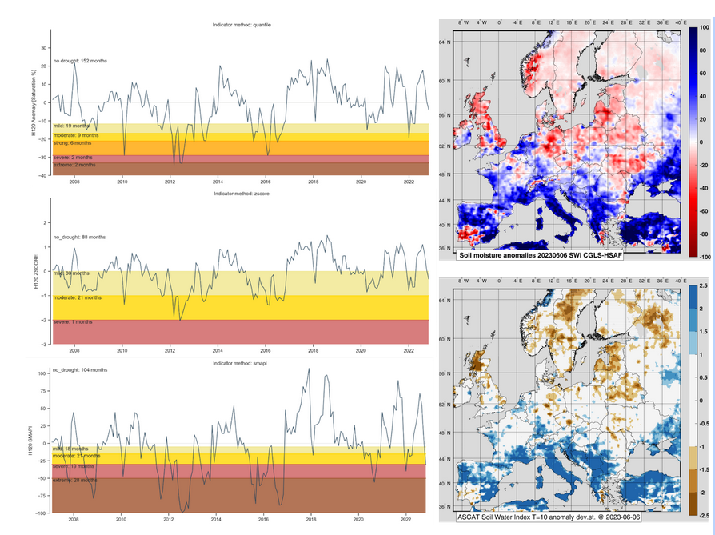

# Soil Moisture & Precipitation

HSAF satellite soil moisture and precipitation data for drought monitoring in EDO.

 

 

## Data collection

### Satellite soil moisture data

- H SAF soil moisture data record (2007-2022, 12.5 km) - CNR IRPI
- CCI Passive soil moisture product (2007-2022, 25 km) - JRC
- SMAP soil moisture (2015-2022, 9 km) - CNR IRPI
- Modelled soil moisture and input precipitation data from LISFLOOD, i.e., the data used in  [EDO - JRC](https://edo.jrc.ec.europa.eu/gdo/php/index.php?id=2112)(5 km).

**Update on 4/7/2023**: _the new version of SM data with higher spatial resolution should be available from the end of August / September. The two versions will be maintained till the end of the year. A comparison, if feasible, is more than welcome._

### Satellite precipitation data

H SAF precipitation data record (2007-2022, 12.5 km), currently SM2RAIN-ASCAT on Zenodo (**INSERT LINK**).

Additional precipitation datasets for triple collocation, e.g., GPM late Run, ERA5 (depending on the input used in EDO, the datasets should be independent)

All the data will be re-gridded to the same spatial grid used in EDO, mask from @Guido.

Open-Earth Monitor Global Workshop 2023 4-6 October 2023 Bolzano

## Data analysis for soil moisture

- Cross-comparison of the different soil moisture products and performance assessment through standard metrics (e.g., correlation, bias, RMSE) and categorical scores (e.g., POD, FAR, TS).
- Computation of drought indices by using multiple approaches: percentage anomalies, standard deviation anomalies, …, see also Fairbairn presentation at EUMETSAT event week
- Assessment of the relative performance of the products through triple collocation (e.g., Brocca et al., 2019) by using multiple triplets
- Integration of the different soil moisture products by using multiple techniques (weighted average, triple collocation, machine learning, …) (e.g., Ciabatta et al., 2019; Massari et al., 2020) and precipitation (later)
- Drought indices comparison in several case studies in Europe (e.g., 2017, 2022, …)

## Expected results

- Soil moisture and precipitation products assessment
- Integrated indices for drought monitoring
- Paper on European scale intercomparison and case studies

