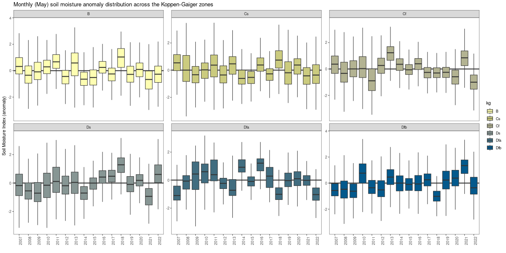

# ESA CCI (PASSIVE)

Some preliminary analysis of ESA-CCI (Passiv) Soil Moisture over the period 2007 - 2022.

## Spatial Mask

See the LISLOOD documentation page.

## ESA-CCI (Passive) Anomalies

Reference period for the anomaly computation: 2007 - 2022

## Annual anomaly distribution (2007 - 2022)

## Monthly anomaly distribution (2007 - 2022)

---

---

---

---

---

---

---

---

---

---

---

## Mann-Kendall test 2007 - 2022 (annual anomalies)

## Mann-Kendall test 2007 - 2022 (monthly anomalies)

## REFERENCES

