# LISFLOOD 

Some preliminary analysis of LISFLOOD Soil Moisture Index over the period 1995 - 2022.

## Spatial Mask

Following Almendra-Martin et al. (2022), the following mask has been used for the analysis of the data. 

The mask merges two information:

- The Köppen-Geiger classification developed by [Beck et al. (2018)](https://www.gloh2o.org/koppen/)
- The Digital Global Map of Irrigation Areas of the [Food and Agriculture Organization (FAO)](https://data.apps.fao.org/catalog/iso/f79213a0-88fd-11da-a88f-000d939bc5d8)

## LISFLOOD Anomalies

Reference period for the anomaly computation: 1995 - 2022

## Annual anomaly distribution (1995 - 2022)

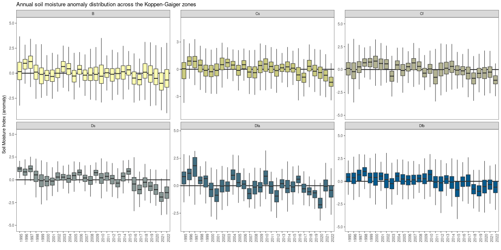

## Monthly anomaly distribution (1995 - 2022)

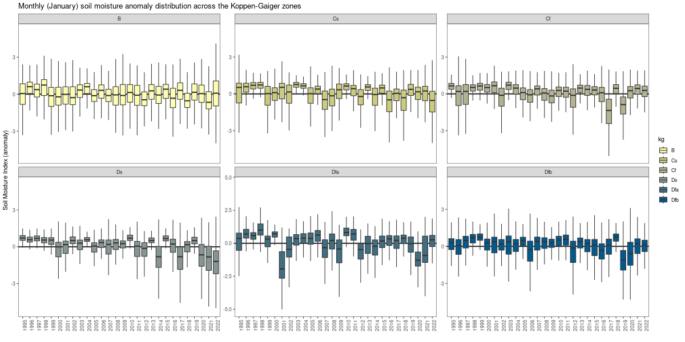

---

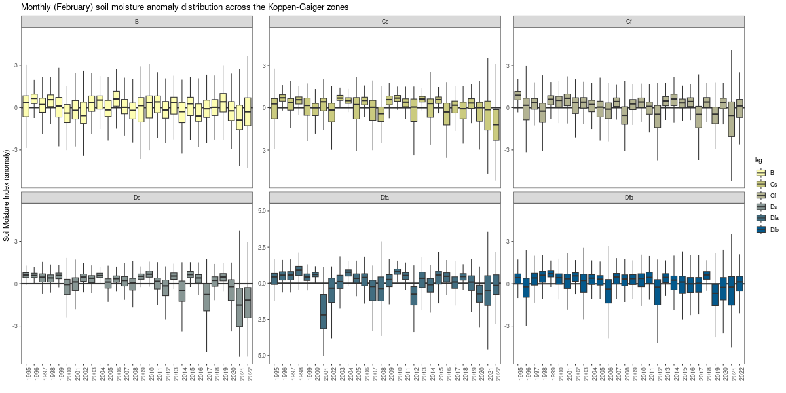

---

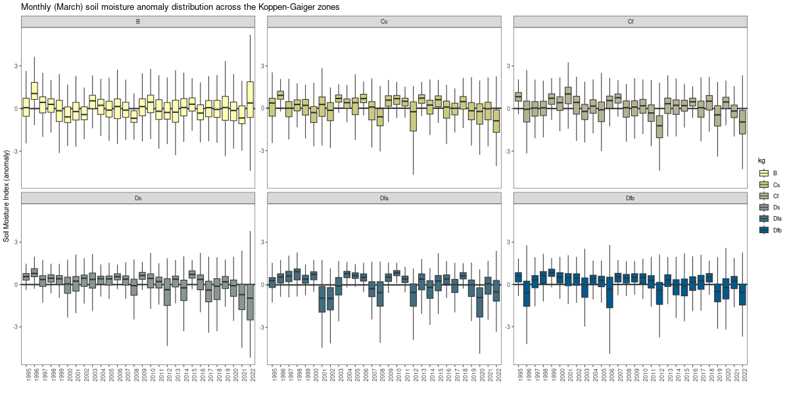

---

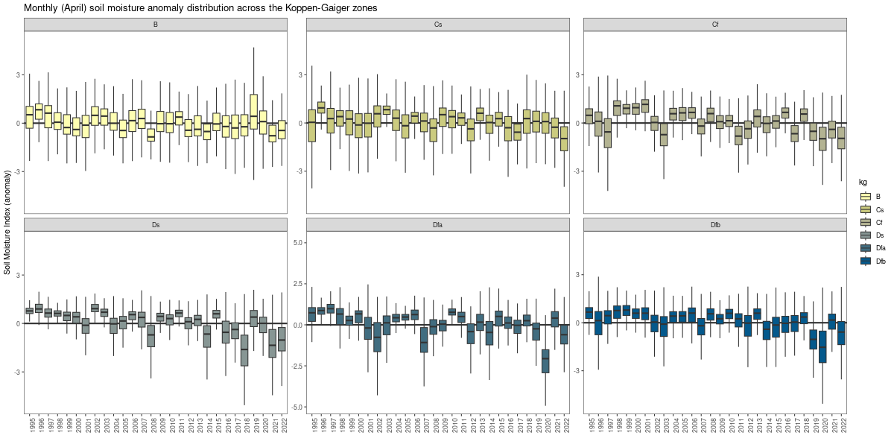

---

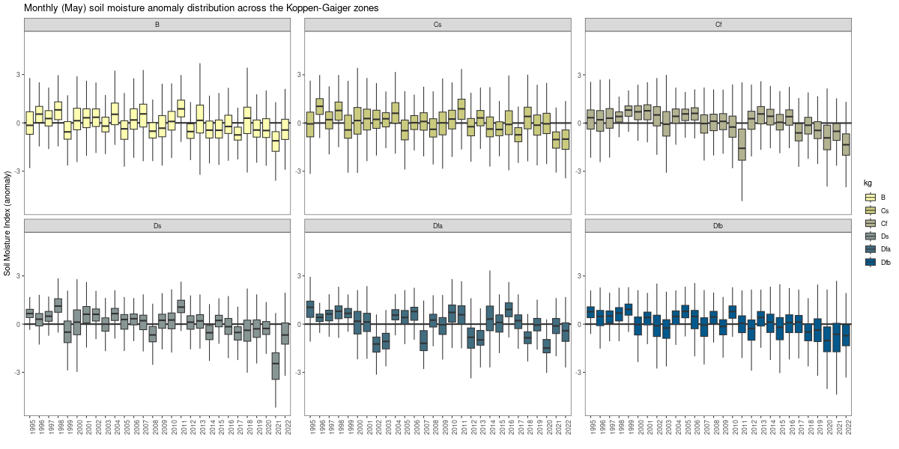

---

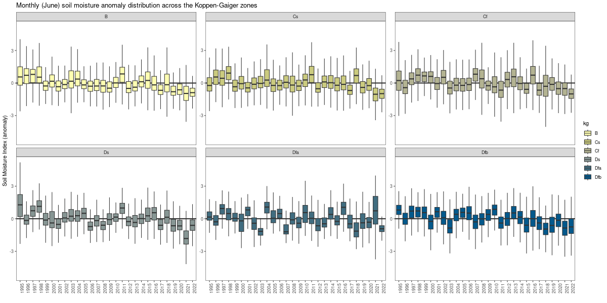

---

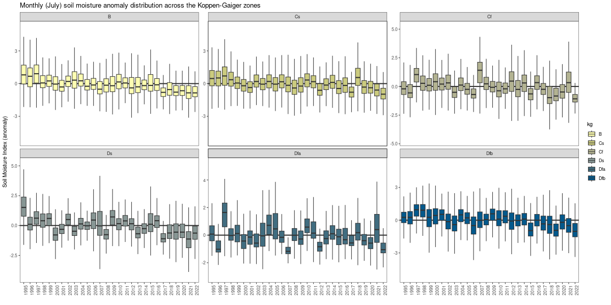

---

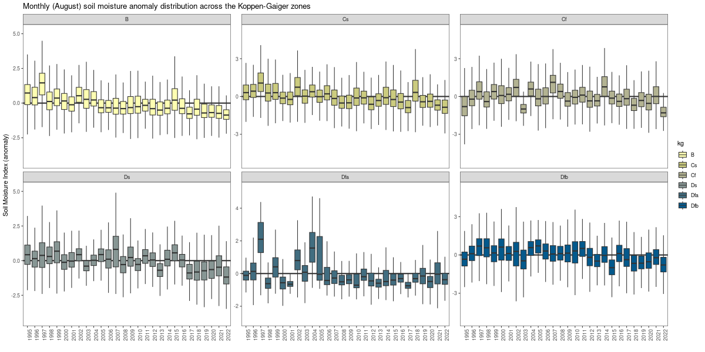

---

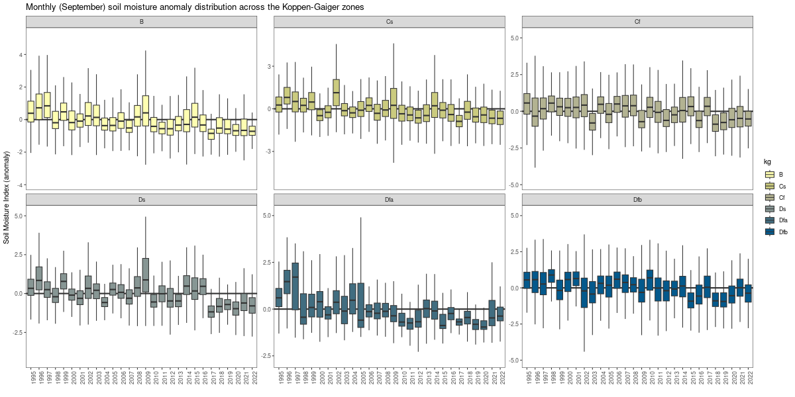

---

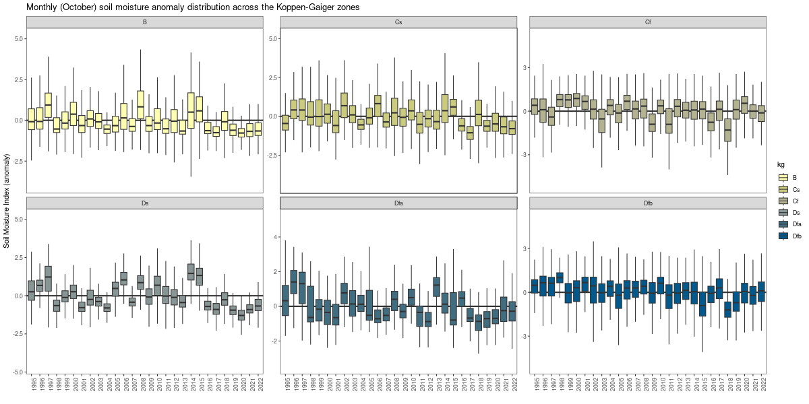

---

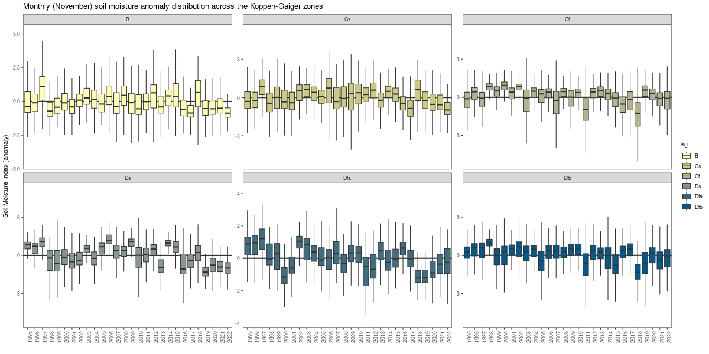

---

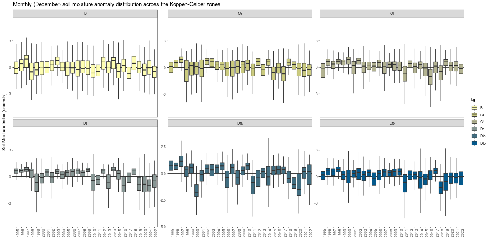

## Mann-Kendall test 1995 - 2022 (annual anomalies)

The map shows the Theil-Sen slope estimators for pixels where the Mann-Kendall test is significant. The test has been applied in the LISFLOOD domain excluding the black areas (the areas mascked by the mask shown at the beginning of this page). 

** The trend is per 10-years **

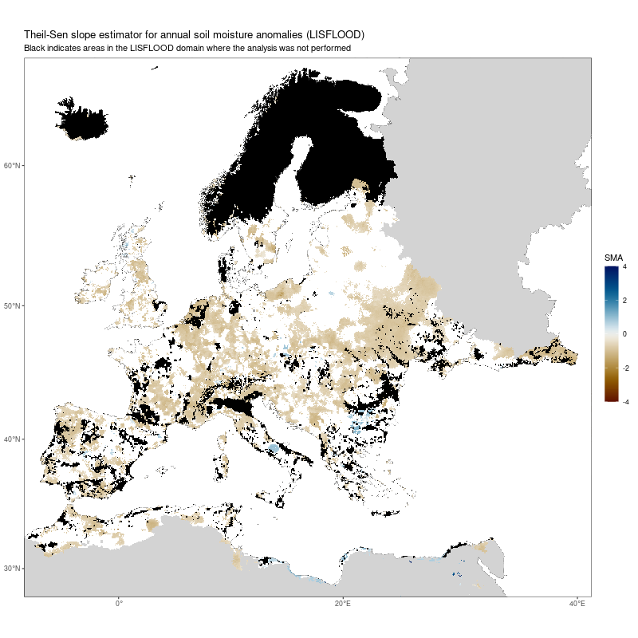

## Mann-Kendall test 1995 - 2022 (monthly anomalies)

## REFERENCES

[Almendra-Martin et al., 2022](https://www.sciencedirect.com/science/article/pii/S0921818122001357#f0005). Analysis of soil moisture trends in Europe using rank-based and empirical decomposition approaches.
